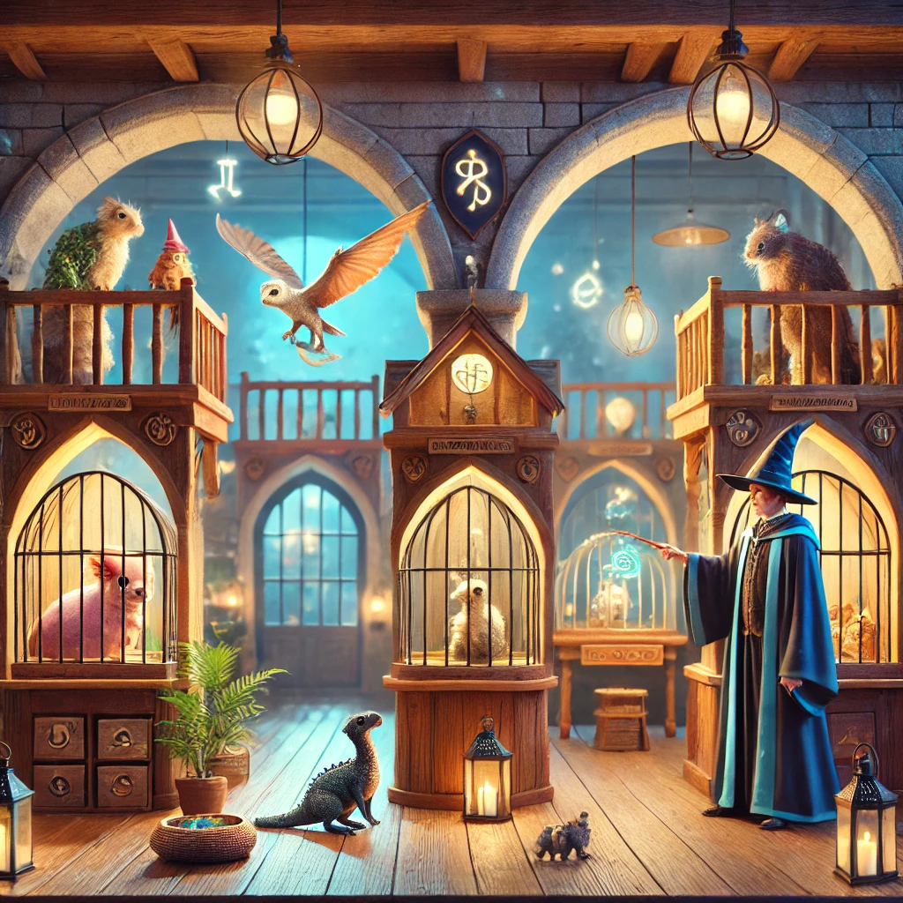
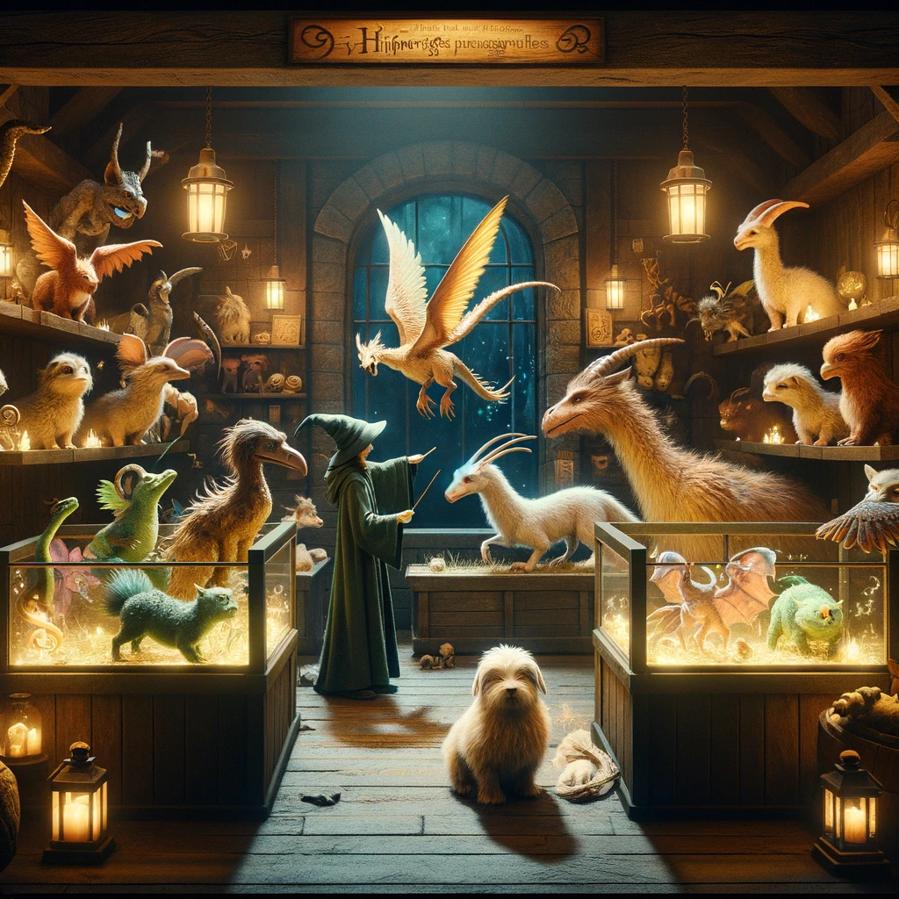

# <samp>OVERVIEW</samp>

Petwards is a powerful API for managing Petwards, shelter for fantastic beasts like nifflers, hippogriffs, and dragons.
Built with Spring and a three-tier architecture, it streamlines shelter management, beast creation, and adoption, along with advanced filtering capabilities, all through distinct layers for presentation, business logic, and data access.
Developed as a group project, it was built by [clawyn](https://github.com/clawyn), [olankens](https://github.com/olankens), and [titou](https://github.com/DelaunoisThibault).



# <samp>FEATURES</samp>

- Anonymous can list and filter beasts
- Filter beasts by name and capabilities
- Three roles: adopter, staff and admin
- Only adopters can adopt beasts
- Only staffs can approve or reject adoption
- Only staffs and admins can add beasts
- Only admins can update shelter infos

# <samp>GUIDANCE</samp>

### Clone and open the project

```shell
git clone https://github.com/olankens/petwards.git
cd petwards ; idea .
```
